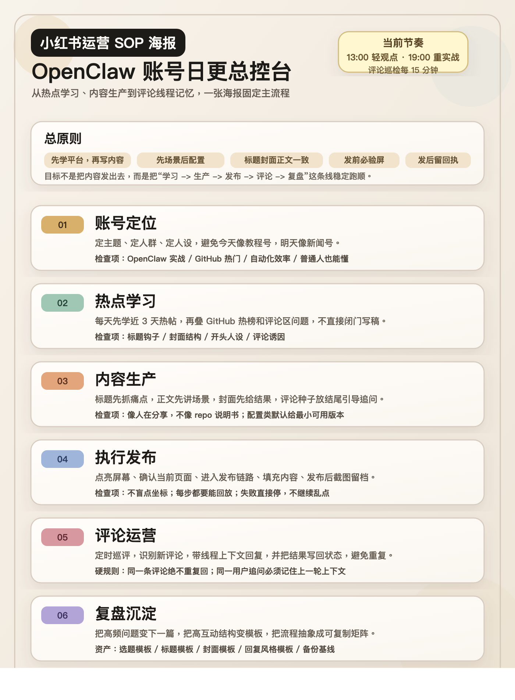

# 小红书运营助手 Skill

一个可公开复用的小红书运营工作流仓库，覆盖这几件事：

- 站内热帖学习
- 选题与文案生成
- 封面图生成
- ADB 发帖执行
- 评论巡检与上下文回复
- 去重和运行状态管理

这套仓库目前偏向 `OpenClaw / GitHub 热门项目 / AI 自动化工作流` 账号，但工作流本身可以改造成其他垂类。

## 风险与免责声明

1. 平台合规：这套工具通过 ADB 驱动物理设备执行发帖和回评，可能违反平台关于自动化操作的条款，存在限流或封号风险。
2. 隐私安全：`data/` 和 `logs/` 会包含你的帖子草稿、评论上下文、调度状态和错误输出，绝不能提交到公开仓库。
3. API Key 安全：`.env` 不应提交到 Git。启用 GCP 远程代理时，Gemini 请求体和 API Key 会通过 SSH 标准输入转发到远程机器，不会出现在命令行里，但你仍然要对远程实例自身安全负责。
4. 设备安全：本工具依赖 USB 调试权限，只应在你信任的本机和网络环境中使用。

## 仓库里有什么

- `src/`
  核心脚本，包含学习、生成、发帖、评论、调度等链路
- `docs/`
  运营 SOP、流程树和演示图片
- `launchd/`
  macOS 定时任务模板
- `scripts/`
  调度启动脚本
- `SKILL.md`
  可作为本地 Skill 使用的说明入口

## 这套流程长什么样





## 适合的场景

- 想做技术向小红书账号，但不想只发“项目介绍卡片”
- 想先学习平台热帖，再生成更像小红书语境的内容
- 想把发帖和回评流程固化成可重复执行的脚本
- 想做多账号矩阵前，先打通单账号 SOP

## 快速开始

1. 安装 Node.js 20+ 和 `adb`
2. 复制 `.env.example` 为 `.env`
3. 打开手机开发者模式和 USB 调试
4. 安装支持 ADB 广播输入的输入法，例如 `ADB Keyboard`
5. 先跑学习和生成，再接发帖和评论链路

### ADB Keyboard 简要接法

1. 在手机上安装 ADB Keyboard
2. 在系统输入法设置里启用它
3. 需要自动输入中文时，将 `XHS_TEXT_MODE` 设为 `adb-keyboard`
4. 脚本会在发送前切换输入法，结束后恢复原输入法

```bash
npm run xhs:study -- --keyword OpenClaw --force
npm run xhs:generate -- --offline
npm run xhs:post-daily
npm run xhs:comments
```

## 常用命令

```bash
# 学习最近 3 天的小红书热帖
npm run xhs:study -- --keyword OpenClaw --force

# 只生成当天内容，不碰手机
npm run xhs:generate -- --offline

# 生成并打开手机里的发帖编辑页
npm run xhs:post-daily

# 直接执行发布
npm run xhs:post-daily -- --publish

# 扫描评论并生成回复草稿
npm run xhs:comments

# 守护式自动回复少量安全评论
npm run xhs:comments -- --auto-send --max-replies 3

# 定时器单次执行
npm run xhs:tick -- --publish --comments
```

## 关键环境变量

基础运行：

- `ADB_BIN`
- `ADB_VENDOR_KEYS`
- `XHS_DEVICE_PROFILE`
- `XHS_TEXT_MODE`
- `XHS_TIMEZONE`
- `XHS_POST_SLOTS`
- `XHS_COMMENT_SWEEP_INTERVAL_HOURS`
- `XHS_MAX_AUTO_REPLIES`

内容生成：

- `GITHUB_TOKEN`
- `XHS_GEMINI_API_KEYS`
- `XHS_GEMINI_TRANSPORT`
- `XHS_REMOTE_OPENCLAW`
- `XHS_REMOTE_TEXT_COMMAND_TEMPLATE`
- `XHS_REMOTE_IMAGE_COMMAND_TEMPLATE`
- `XHS_REMOTE_ALLOW_UNSAFE_PROMPT_TEMPLATE` 默认关闭，建议始终使用 `{PROMPT_B64}`

## 注意事项

- 每次设备动作前都要先确认亮屏
- 同一条可见评论绝不能重复回复
- 回复必须带线程上下文，不能只看最后一句
- 高风险、引战、争议评论不要全自动回复
- 这套仓库不包含绕过审核或伪装真人行为
- 远端命令模板默认只建议使用 `{PROMPT_B64}`，不要把原始提示词直接拼进 shell
- `data/` 和 `logs/` 属于个人运营数据，不要改 `.gitignore` 去提交它们
- 日志可能包含接口错误详情和评论上下文，建议定期清理

## 公开版里刻意去掉了什么

- 个人目录路径
- 本地密钥和环境文件
- 实际账号数据
- 评论历史、运行状态、日志
- 本机安装过的 LaunchAgent 配置

## 定时任务模板

`launchd/com.openclaw.xhs-automation.plist.template` 使用了 `__WORKDIR__` 占位符。使用前请替换成你自己的绝对路径，再通过 `launchctl` 加载。

## License

本仓库默认导出 MIT License，见 [LICENSE](./LICENSE)。
